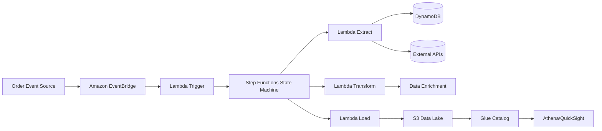

# Architecture Documentation

## System Architecture

### High-Level Design



## Component Details

### 1. Event Sources

**Order Event Structure:**
```json
{
  "version": "0",
  "id": "unique-event-id",
  "detail-type": "OrderCreated",
  "source": "ecommerce.orders",
  "account": "123456789012",
  "time": "2026-04-05T10:30:00Z",
  "region": "us-east-1",
  "detail": {
    "orderId": "ORD-2026-001234",
    "customerId": "CUST-567890",
    "orderDate": "2026-04-05T10:30:00Z",
    "totalAmount": 299.99,
    "currency": "USD",
    "items": [
      {
        "productId": "PROD-123",
        "quantity": 2,
        "unitPrice": 149.99
      }
    ],
    "shippingAddress": {
      "street": "123 Main St",
      "city": "New York",
      "state": "NY",
      "zipCode": "10001"
    }
  }
}
```

### 2. Amazon EventBridge

**Event Rules:**
- **Rule 1**: Match all `OrderCreated` events
- **Rule 2**: Match `OrderUpdated` events
- **Rule 3**: Match high-priority orders (amount > $1000)

**Event Pattern Example:**
```json
{
  "source": ["ecommerce.orders"],
  "detail-type": ["OrderCreated", "OrderUpdated"],
  "detail": {
    "totalAmount": [
      { "numeric": [">", 0] }
    ]
  }
}
```

### 3. Lambda Trigger Function

**Responsibilities:**
- Validate event schema
- Enrich event with metadata
- Start Step Function execution
- Handle idempotency (prevent duplicate processing)

**Input/Output:**
```python
# Input: EventBridge event
# Output: Step Function execution ARN and metadata
{
  "executionArn": "arn:aws:states:...",
  "startDate": "2026-04-05T10:30:01Z",
  "orderId": "ORD-2026-001234"
}
```

### 4. AWS Step Functions State Machine

**State Machine Definition:**

```
┌─────────────────┐
│  Start          │
└────────┬────────┘
         │
         ▼
┌─────────────────┐
│  Extract        │ ◄─── Lambda 1
└────────┬────────┘
         │
         ▼
┌─────────────────┐
│  Transform      │ ◄─── Lambda 2
└────────┬────────┘
         │
         ▼
┌─────────────────┐
│  Load           │ ◄─── Lambda 3
└────────┬────────┘
         │
         ▼
┌─────────────────┐
│  Success        │
└─────────────────┘
```

**Error Handling:**
- Each step has retry logic (3 attempts with exponential backoff)
- Catch blocks for specific error types
- Failure notification via SNS

### 5. Lambda 1 - Extract Function

**Purpose:** Gather all required data for order processing

**Data Sources:**
- **DynamoDB**: Customer profiles, order history
- **RDS**: Product catalog, inventory
- **Third-party APIs**: Payment verification, fraud check
- **S3**: Historical customer data

**Output Schema:**
```json
{
  "orderId": "ORD-2026-001234",
  "extractedData": {
    "customer": {
      "customerId": "CUST-567890",
      "name": "John Doe",
      "email": "john@example.com",
      "tier": "Gold",
      "lifetimeValue": 5000.00
    },
    "products": [
      {
        "productId": "PROD-123",
        "name": "Premium Widget",
        "category": "Electronics",
        "inStock": true,
        "supplier": "SupplierA"
      }
    ],
    "fraudScore": 0.12,
    "paymentVerified": true
  },
  "extractTimestamp": "2026-04-05T10:30:02Z"
}
```

**Performance Considerations:**
- Parallel API calls using asyncio
- Connection pooling for database connections
- Caching for frequently accessed data (ElastiCache)
- Timeout: 30 seconds

### 6. Lambda 2 - Transform Function

**Purpose:** Cleanse, enrich, and format data for analytics

**Transformations:**
1. **Data Cleansing:**
   - Standardize addresses (USPS validation)
   - Normalize phone numbers
   - Remove PII for analytics

2. **Enrichment:**
   - Calculate tax based on location
   - Apply discounts and promotions
   - Compute shipping costs
   - Add geolocation data

3. **Aggregation:**
   - Order summary statistics
   - Customer purchase patterns
   - Product performance metrics

4. **Formatting:**
   - Convert to Parquet for efficient storage
   - Partition by date and region
   - Add metadata fields

**Output Schema:**
```json
{
  "orderId": "ORD-2026-001234",
  "processedData": {
    "orderSummary": {
      "subtotal": 299.98,
      "tax": 24.00,
      "shipping": 10.00,
      "discount": 0.00,
      "total": 333.98
    },
    "customerMetrics": {
      "orderCount": 15,
      "averageOrderValue": 275.50,
      "customerSegment": "HighValue"
    },
    "analytics": {
      "productCategories": ["Electronics"],
      "region": "Northeast",
      "channel": "Web"
    }
  },
  "transformTimestamp": "2026-04-05T10:30:05Z"
}
```

**Libraries Used:**
- pandas: Data manipulation
- numpy: Numerical computations
- pydantic: Schema validation
- pyarrow: Parquet conversion

### 7. Lambda 3 - Load Function

**Purpose:** Store processed data in S3 data lake

**S3 Structure:**
```
s3://ecommerce-data-lake/
├── orders/
│   ├── year=2026/
│   │   ├── month=04/
│   │   │   ├── day=05/
│   │   │   │   ├── hour=10/
│   │   │   │   │   └── orders_10.parquet
│   │   │   │   └── hour=11/
│   │   │   └── day=06/
│   │   └── month=05/
├── customers/
│   └── [similar partitioning]
└── products/
    └── [similar partitioning]
```

**Loading Process:**
1. Convert to Parquet format
2. Partition by date hierarchy (year/month/day/hour)
3. Write to S3 with server-side encryption
4. Update Glue Data Catalog
5. Trigger crawler for schema updates

**Performance:**
- Batch writes for efficiency
- S3 multipart upload for large files
- Compression (snappy codec)
- S3 lifecycle policies for data retention

## Data Flow

### Complete Flow Example

```
1. Order Created in Application
   ↓
2. Event Published to EventBridge
   {
     "detail-type": "OrderCreated",
     "detail": { "orderId": "ORD-001", "amount": 299.99 }
   }
   ↓
3. Lambda Trigger Receives Event
   - Validates schema
   - Starts Step Function
   ↓
4. Step Function Executes
   ├─ Extract: Fetches customer, product, payment data
   ├─ Transform: Calculates tax, enriches with metadata
   └─ Load: Writes to S3 as partitioned Parquet
   ↓
5. Data Available for Analytics
   - Athena queries
   - QuickSight dashboards
   - ML model training
```

## Scalability

### Throughput
- **EventBridge**: 10,000+ events/second
- **Step Functions**: 4,000+ executions/second
- **Lambda**: Concurrent executions (default: 1,000, can increase)
- **S3**: 5,500+ PUT requests/second per prefix

### Optimization Strategies
1. **Lambda Reserved Concurrency**: Prevent throttling
2. **EventBridge Archive**: Replay failed events
3. **S3 Lifecycle**: Move old data to Glacier
4. **Athena Federation**: Query multiple data sources
5. **Caching**: ElastiCache for hot data

## Security Architecture

### IAM Roles

**Lambda Trigger Role:**
- EventBridge: Receive events
- Step Functions: StartExecution
- CloudWatch Logs: PutLogEvents

**Lambda Extract Role:**
- DynamoDB: GetItem, Query
- Secrets Manager: GetSecretValue
- VPC: CreateNetworkInterface (if in VPC)

**Lambda Transform Role:**
- CloudWatch Logs: PutLogEvents
- X-Ray: PutTraceSegments

**Lambda Load Role:**
- S3: PutObject, PutObjectAcl
- Glue: UpdateTable, CreatePartition
- KMS: Encrypt, Decrypt

### Encryption

- **At Rest**: 
  - S3: SSE-KMS with customer-managed keys
  - DynamoDB: Encryption enabled
  
- **In Transit**:
  - TLS 1.2+ for all API calls
  - VPC Endpoints for AWS service communication

### Network Security

- Lambda functions in private subnets (optional)
- NAT Gateway for internet access
- VPC Endpoints for AWS services (S3, DynamoDB, Secrets Manager)
- Security groups with least privilege

## Monitoring and Observability

### CloudWatch Metrics

**Custom Metrics:**
- Order processing rate
- ETL duration by stage
- Error rate by type
- Data volume processed

**Alarms:**
- Lambda invocation errors > 5%
- Step Function execution failures > 2%
- ETL duration > 60 seconds
- S3 storage cost exceeds budget

### Logging Strategy

```
CloudWatch Log Groups:
/aws/lambda/order-trigger
/aws/lambda/order-extract
/aws/lambda/order-transform
/aws/lambda/order-load
/aws/stepfunctions/order-processing
```

**Log Retention**: 30 days (adjustable)

### Tracing

- AWS X-Ray enabled on all Lambda functions
- Distributed tracing across the entire pipeline
- Service map visualization
- Latency analysis by segment

## Disaster Recovery

### Backup Strategy
- S3 versioning enabled
- Cross-region replication for critical data
- DynamoDB point-in-time recovery
- Infrastructure as Code in version control

### RTO/RPO
- **Recovery Time Objective**: 1 hour
- **Recovery Point Objective**: 5 minutes
- EventBridge event archive for replay

## Cost Optimization

### Strategies
1. **Right-sizing**: Optimize Lambda memory allocation
2. **Reserved Capacity**: For predictable workloads
3. **S3 Intelligent-Tiering**: Automatic cost optimization
4. **Lifecycle Policies**: Archive old data
5. **Monitoring**: AWS Cost Explorer and Budgets

### Estimated Monthly Costs (10k orders/day)

| Service | Usage | Cost |
|---------|-------|------|
| EventBridge | 300k events | $0.30 |
| Lambda | 1.2M invocations | $2.40 |
| Step Functions | 300k transitions | $7.50 |
| S3 | 10GB storage | $0.23 |
| DynamoDB | On-demand | $10.00 |
| **Total** | | **~$20.43** |

## Comparison: Step Functions vs Airflow

| Feature | Step Functions | Airflow |
|---------|----------------|---------|
| Management | Fully managed | Self-managed (MWAA is managed) |
| Cost | Pay per transition | Minimum $300/month (MWAA) |
| Scaling | Automatic | Manual configuration |
| Integration | Native AWS | Requires operators |
| Visual UI | Built-in | Web UI |
| Best For | Event-driven, AWS-centric | Complex scheduling, multi-cloud |

**Why Step Functions for this project:**
- Serverless (no infrastructure)
- Tight AWS integration
- Cost-effective for event-driven workloads
- Built-in retry and error handling
- Visual workflow monitoring
